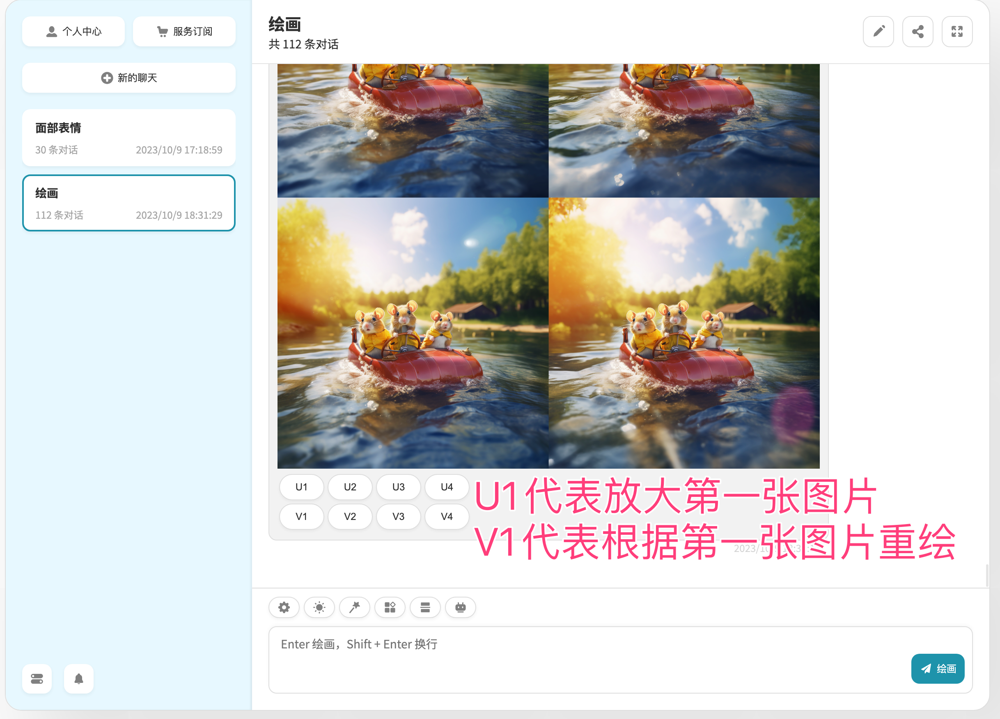

# MJ使用指南

#### Prompts

提示是Midjourney Bot解释为生成图像的短文本短语。Midjourney Bot将提示中的单词和短语分解成较小的部分，称为令牌，可以与其训练数据进行比较，然后用于生成图像。设计良好的提示可以帮助生成独特且令人兴奋的图像。

#### Video

**结构**

基本提示 基本提示可以简单到单个单词、短语或表情符号！

高级提示 更高级的提示可以包括一个或多个图像URL、多个文本短语和一个或多个参数

“图像提示” 可以将图像URL添加到提示中，以影响最终结果的风格和内容。图像URL始终位于提示的最前面。

“提示文本” 您要生成的图像的文本描述。请查看下面的提示信息和提示。设计良好的提示有助于生成惊人的图像。

“参数” 参数会更改图像的生成方式。参数可以更改纵横比、模型、放大器等等。参数位于提示的末尾。

**提示笔记**

提示长度 提示可以非常简单。单词（甚至表情符号！）将生成图像。非常简短的提示将严重依赖于Midjourney的默认样式，因此更具描述性的提示对于独特的外观更好。但是，超长的提示并不总是更好的。关注您要创建的主要概念。

语法 Midjourney Bot不理解语法、句子结构或人类的单词。单词选择也很重要。在许多情况下，更具体的同义词效果更好。尽可能删除单词。较少的单词意味着每个单词都具有更强的影响力。使用逗号、括号和连字符来帮助组织您的思想，但要知道Midjourney将无法可靠地解释它们。Midjourney不考虑大写字母。

**Midjourney模型在解释传统句子结构方面略优于其他模型。**

专注于您想要的 更好地描述您想要的而不是您不想要的。如果您要求“没有蛋糕”的聚会，您的图像可能会包括蛋糕。如果您想确保最终图像中没有对象，请尝试使用“-no”参数进行高级提示。

考虑重要的细节 任何未提及的内容可能会让您感到惊讶。具体和抽象都可以，但是任何您忽略的内容都将被随机化。含糊不清是获得品种的好方法，但您可能无法获得想要的具体细节。 尝试清楚地表达任何与您相关的情境或细节。 考虑： 主题：人、动物、角色、位置、对象等。 媒介：照片、绘画、插图、雕塑、涂鸦、挂毯等。 环境：室内、室外、月球、纳尼亚、水下、翡翠之城等。 照明：柔和、环境、阴天、霓虹灯、工作室灯等。 颜色：鲜艳、柔和、亮丽、单色、多彩、黑白、粉彩等。 心情：安静、冷静、狂乱、充满活力等。 构图：肖像、特写、特写、鸟瞰图等。

使用集体名词 复数词会留下很多机会。尝试指定数字。“三只猫”比“猫”更具体。集体名词也起作用，“一群鸟”而不是“鸟”。

#### 探索 Prompting

即使是简短的单词提示，Midjourney的默认样式也会生成美丽的图像，但您可以通过组合诸如艺术媒介、历史时期、位置等概念来创建更有趣的个性化结果。

**选择媒介**

画出油画、蜡笔画、刮画板、印刷机、闪粉、墨水和彩色纸张。指定艺术媒介是生成时尚图像的最佳方式之一。

提示示例： prompt （任何艺术风格）三只划船的老鼠

<figure><figcaption></figcaption></figure>

* 放大按钮

`U1` `U2` `U3` `U4` U按钮放大图像，生成所选图像的更大版本并添加更多细节。

* 重新运行

🔄 重新运行（再掷）按钮可以重新运行工作。在这种情况下，它将重新运行原始提示，生成新的图像网格。

* 变体按钮

`V1` `V2` `V3` `V4` V按钮创建所选网格图像的增量变体。创建变体会生成一个新的图像网格，类似于所选图像的整体风格和构图。

* zoomOut倍率放大

在进行U1放大后，可继续对图片进行zoomOut倍率放大。

\
